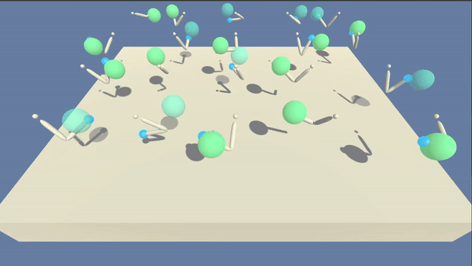

# Robot Arm Reinforcement learning control

The goal of this repo is to train an agent in the form of a 2-joint robot arm and maintain its position at the target location for as many time steps as possible. 

## Project Details

The below illustration shows the final outcome of the current solution that uses an actor-critic mehod to solve the problem.

In this project we tackle 2 different problems. One where there is a single robot arm and another where there are 20 robot arms as shown in the illustration above.

* A reward of `+0.1` is provided for each step that the agent's hand is in the goal location. Thus, the goal of your agent is to maintain its position at the target location for as many time steps as possible.
  
* The problem is considered solved when the score is higher than 30 along 100 consecutive episodes. If multiple agent-case is selected the score is the avarage score over all 20 agents.
  
* The observation space consists of `33` variables corresponding to position, rotation, velocity, and angular velocities of the arm.  
  
* Each action is a vector with four numbers, corresponding to torque applicable to two joints.  Every entry in the action vector must be a number between `-1` and `1`.

For more details on the project solution please read the [report.md](report.md) file.

## Environment setup

All commands below must be run in the project's folder `cd <path_to_root_folder_of_this_project>`

### First lets donwload all required files

* Make sure to download the environment builded in unity with ml_agents extension

    For linux:
    1. A single robot-arm problem scenario: [here](https://s3-us-west-1.amazonaws.com/udacity-drlnd/P2/Reacher/one_agent/Reacher_Linux.zip)
    2. Multiple robot-arms problem scenario: [here](https://s3-us-west-1.amazonaws.com/udacity-drlnd/P2/Reacher/Reacher_Linux.zip)

### Install dependencies with docker

For this project a docker container was created, please follow the following steps to setup the environment:

1. Build Dockerfile

    `docker build -t unity_ml_agents:pytorch .`

2. Create container (this assumes you want to run the project on GPU)

    ``docker run --name mlagents_unity -v /tmp/.X11-unix:/tmp/.X11-unix -e DISPLAY=$DISPLAY -v `pwd`:/project -it --env QT_X11_NO_MITSHM=1 --device /dev/dri --privileged --gpus all unity_ml_agents:pytorch``

3. Everytime we want to run container

    `docker start mlagents_unity`

    `docker exec -it mlagents_unity bash`

## How to run

The main script is in the [Continuous Control Robot_arm.ipynb](Continuous%20Control%20Robot_arm.ipynb) file, where you can run a dummy model that selects and action randomly. You can also train a DDPG model with 20 agents and use it in inference of new cases. For instance you can extrapolate the trained model with 20-agents to predict movements in the 1-agent case.

If you want to check the agents model you can find it under the folder: [agents/ddpg/](agents/ddpg/). In this folder the main logic for the agent models is implemented in the [ddpg_agent.py](agents/ddpg/ddpg_agent.py). 

* [actor_critic_models.py](agents/ddpg/actor_critic_models.py) constains the two neural networks used to build the ddpg agent
* [helpers.py](agents/ddpg/helpers.py) constains all ddpg funtions that assist ddpg logic such as the replay buffer and the Ornstein-Uhlenbeck noise.
* Finally the [parameters.py](agents/ddpg/parameters.py) script constains all the parameters that could be changed in this project. If you are interested in trying different training processes this is the file you are looking for.
