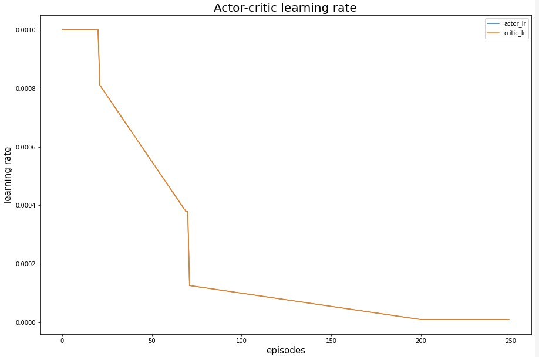
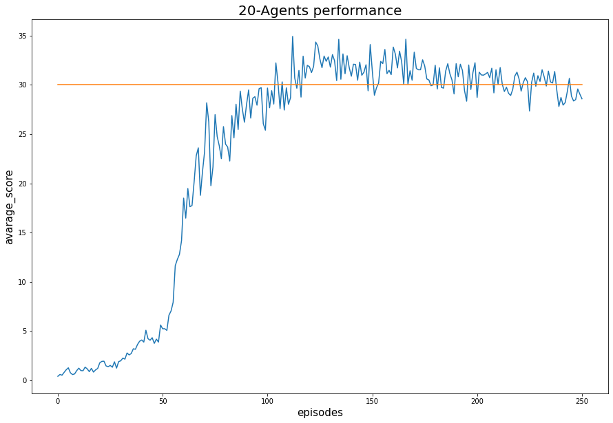
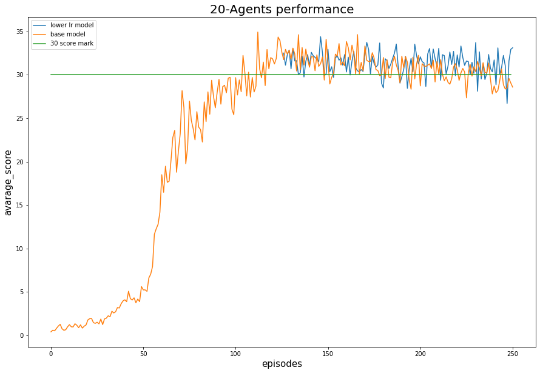
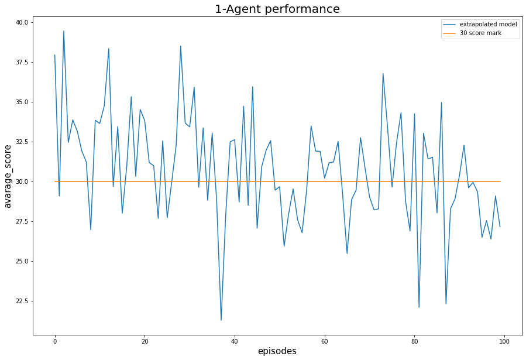
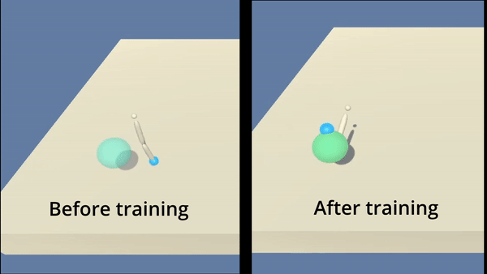

# Robot arm RL continuous control details

The idea behind the solution taken for this problem was to solve the 20-agent scenario first because we want to take advantage of the multiple inputs to converge the model faster. Kind of the idea explained in the [Asynchronous Advantage Actor-Critic (A3C) paper](https://arxiv.org/pdf/1602.01783.pdf). 

However, the model we end up using was the [Deep Deterministic Policy Gradient (DDPG)](https://arxiv.org/abs/1509.02971). We used this model because it is aimed for solving continuous action spaces and because it is state of the art at the moment of writing this documentation.

## Learning Algorithm (DDPG)

DDPG is an actor-critic technique that is also known as the Deep Q network (DQN) method for continuous action spaces. DDPG is an off-policy method tha uses two networks, one to train a policy-based model and another to estimate a value-function method, the latter one in an off-policy manner.

Some of the features that DDPG implements in its algorithm are the following:

* **Replay buffer**. Yes, the same one proposed in the DQN model. However, it could also use parallel agent update as in A3C.
* Implements **"soft updates"** which contrary to DQN the critic network is updated slowly with certain percentage of the actor weights on each episode. This makes the model more stable.
* **Ornstein–Uhlenbeck Noise** which is a noise process that has some properties for letting the agent explore. You can check more details on the concept in the [Ornstein–Uhlenbeck process](https://en.wikipedia.org/wiki/Ornstein%E2%80%93Uhlenbeck_process) page. It essentially generates random samples from a Gaussian (Normal) distribution, but each sample affects the next one such that two consecutive samples are more likely to be closer together than further apart. In this sense, the process is Markovian in nature. We use this noise because we want that our actions are consecutive (as continuous as possible) otherwise the signals can be jerky and jump from one value to another which is not desirable in control systems.

The algorithm was based on the following implementation from Udacity's implementation of DDPG [here](https://github.com/udacity/deep-reinforcement-learning/blob/master/ddpg-bipedal/ddpg_agent.py)

The main changes done to it were extra support for multiple agents in the following lines:

```
Q_targets = (rewards + (gamma * Q_targets_next.view(No_agents, -1) * (1 - dones))).view(-1, 1) # Support to learn for N agents`

torch.nn.utils.clip_grad_norm_(self.critic_local.parameters(), 1) # This line mitigates exploding gradients

```

The later line was crucial because without it the DDPG model can't hold the score throught the episodes because as 20 agents are updating the networks the gradient update leads to [exploding gradients](https://machinelearningmastery.com/exploding-gradients-in-neural-networks/)

### Parameters

All the parameters used in this project are stored in the following file [parameters.py](agents/ddpg/parameters.py)

The final parameters used were the following:

```python
EPISODES = 250          # Number of episodes to train
BUFFER_SIZE = int(3e5)  # replay buffer size
BATCH_SIZE = 512        # minibatch size
GAMMA = 0.99            # discount factor
TAU = 1e-4              # for soft update of target parameters
LR_ACTOR = 1e-3         # learning rate of the actor 
LR_CRITIC = 1e-3        # learning rate of the critic
WEIGHT_DECAY = 1e-6     # L2 weight decay of the critic

```

The optimizer used was an Adam optimizer for both neural networks.

However, we noticed that if we keep these parameters static, the model converges to a lower score of around 20 - 22. Thus, we modified the learning rate of both models (actor and critic networks) based on the following curve.



## Results

After training for 250 episodes we finally solved the problem which is better illustrated by the following plot of rewards:

| <b>First run plot of rewards</b>|
|:--:|
|  |


where we can see that around episode 120 we solve the problem because the mean score of the 20 agents scored more than 30 in avarage in the next 100 consecutive episodes. 

We also recorded the model at different stages of the model which are all stored in the folder: [checkpoints](checkpoints/). This allowed us to see how the model was learning during the training process, as illustrated below:

<p align="center">

</p>

In the [checkpoints](checkpoints/) folder you will find two subfolders because there are two versions that I tried. I noticed that by reducing the learning rate the model gets more stable, hence I tried to reduce the model once it got to the 125 episode because that was the closest checkpoint where we can see the model reaches its best performance. 

Therefore, for the second run we started from the 125 episode with a `learning rate = 1e-8` for both of the actor and critic networks and the results are shown in the following plot of rewards:

| <b>Second run plot of rewards</b>|
|:--:|


As you can see the model does get a little bit more stable (blue line) compared to the old version (orange line), but it is not as significant I thought. However, the agent got a higher overall average score which was great.

* First run mean score: 30.61899931561202
* Second run mean  score: 31.413505964520077

### Extrapolation to the One-agent case

Since we already got a good policy using the multi-agent approach. I decided to use the same policy for the one agent case. Thus, I run 100 episodes with this policy learned in the one-agent environment where I got an avarage score of `30.82739226` which is illustrated in the following plot of rewards:



We have also recorded a comparison of the single agent before and after training the agent with the multi-agent environment just to get a better contrast of both cases as shown below:

<p align="center">

</p>

## Future work ideas

To improve the performance in this project I have some ideas that I would love to implement, the following is a list of all the ideas I have to try in this project:

1. Implement Trust Region Policy Optimization (TRPO) and Truncated Natural Policy Gradient (TNPG) because based on [this paper](https://arxiv.org/abs/1604.06778) they should achieve a better performance.
2. Implement Proximal Policy Optimization (PPO) which has demostrated great performance as shown in the [openai page](https://openai.com/blog/openai-baselines-ppo/)
3. Also would like to try one of the newest models [Distributed Distributional Deterministic Policy Gradients](https://openreview.net/forum?id=SyZipzbCb) which is another method to adapt DDPG for continuous control.
